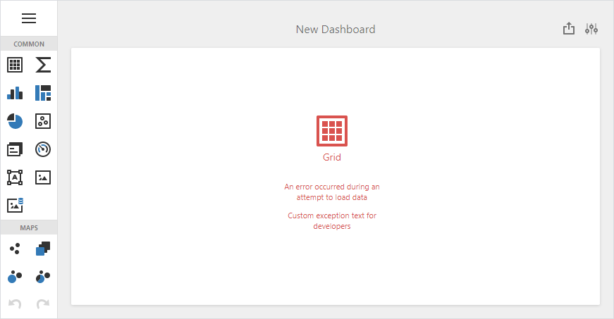
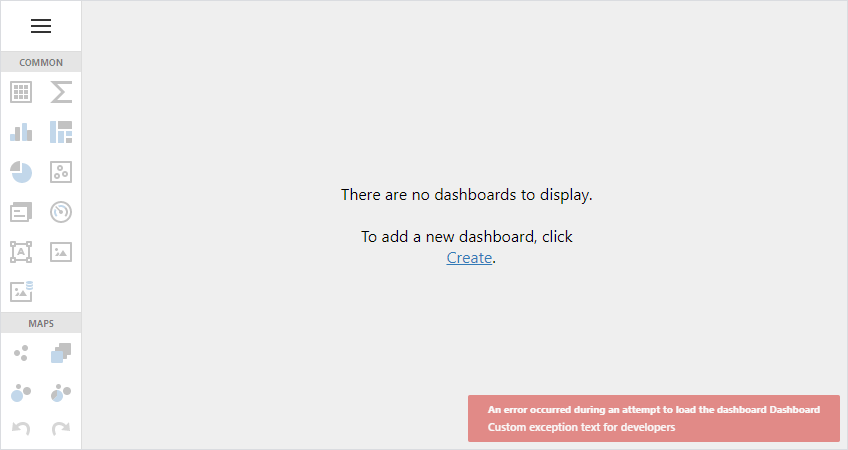

<!-- default badges list -->

[](https://supportcenter.devexpress.com/ticket/details/T894095)
[](https://docs.devexpress.com/GeneralInformation/403183)
<!-- default badges end -->
# Dashboard for ASP.NET Core - How to handle errors

The following example demostrates two approaches on how to handle errors in the ASP.NET Core Dashboard application:

- How to specify custom text for internal Dashboard errors
- How to throw a custom exception during a server-side processing and display the error in the Dashboard error toast


## How to specify custom text for internal Dashboard errors

### Files to Review

* [Startup.cs](./CS/AspNetCoreCustomTextForInternalDashboardErrors/Startup.cs) 
* [CustomDashboardController.cs](./CS/AspNetCoreCustomTextForInternalDashboardErrors/Controllers/CustomDashboardController.cs)
* [Index.cshtml](./CS/AspNetCoreCustomTextForInternalDashboardErrors/Views/Home/Index.cshtml)

### Description

The dashboard in this project contains invalid data connection. This example shows how to override the default text in the exception that occurs when a controller tries to load data.



Implement the `IExceptionFilter` interface to create a custom exception filter and specify a custom exception message. The displayed text depends on whether the application is in development mode:

```cs
public class CustomExceptionFilter : IExceptionFilter {
	internal bool isDevelopmentMode = false;

	public CustomExceptionFilter(IWebHostEnvironment hostingEnvironment) {
		this.isDevelopmentMode = hostingEnvironment.IsDevelopment();
	}
	string GetJson(string message) {
		return $"{{ \"Message\":\"{message}\" }}";

	}        

	public virtual void OnException(ExceptionContext context) {
		if(context.ExceptionHandled || context.Exception == null) {
			return;
		}

		context.Result = new ContentResult {
			Content = GetJson(!isDevelopmentMode ? "Custom exception text for end users" : "Custom exception text for developers"),
			ContentType = "application/json",
			StatusCode = (int)HttpStatusCode.BadRequest
		};

		context.ExceptionHandled = true;
	}
}
```

Create a custom controller that uses the custom exception filter:

```cs
namespace AspNetCoreDashboard.ExceptionOnDataLoading.Controllers
{
    [TypeFilter(typeof(CustomExceptionFilter))]
    public class CustomDashboardController : DashboardController {
        public CustomDashboardController(DashboardConfigurator configurator) : base(configurator) { }
    }
}
```

Specify the `CustomDashboard` controller when you configure endpoints:

```cs
public void Configure(IApplicationBuilder app, IWebHostEnvironment env) {
	// ...
	app.UseEndpoints(endpoints => {
		EndpointRouteBuilderExtension.MapDashboardRoute(endpoints, "api/dashboards", "CustomDashboard");
		endpoints.MapControllerRoute(
			name: "default",
			pattern: "{controller=Home}/{action=Index}/{id?}"
		);
	});

	app.UseStaticFiles();
	app.UseDevExpressControls();
}
```


## How to throw a custom exception during a server-side processing and display the error in the Dashboard error toast

### Files to Review

* [Startup.cs](./CS/AspNetCoreCustomExceptionErrorToast/Startup.cs) 
* [CustomDashboardController.cs](./CS/AspNetCoreCustomExceptionErrorToast/Controllers/CustomDashboardController.cs)
* [Index.cshtml](./CS/AspNetCoreCustomExceptionErrorToast/Views/Home/Index.cshtml)

### Description
This example shows how to throw a custom exception when a controller loads a dashboard.



Implement the `IExceptionFilter` interface to create a custom exception filter. The displayed text depends on whether the application is in development mode:

```cs
public class CustomExceptionFilter : IExceptionFilter {
    internal bool isDevelopmentMode = false;

    public CustomExceptionFilter(IWebHostEnvironment hostingEnvironment) {
        this.isDevelopmentMode = hostingEnvironment.IsDevelopment();
    }
    string GetJson(string message) {
        return $"{{ \"Message\":\"{message}\" }}";
    }

    public virtual void OnException(ExceptionContext context) {
        if(context.ExceptionHandled || context.Exception == null) {
            return;
        }

        CustomException customException = context.Exception as CustomException;
        string message = customException != null ? (isDevelopmentMode ? CustomException.UnsafeMessage : CustomException.SafeMessage) : "";

        context.Result = new ContentResult {
            Content = GetJson(message),
            ContentType = "application/json",
            StatusCode = (int)HttpStatusCode.BadRequest
        };

        context.ExceptionHandled = true;
    }
}
```

Create a custom controller that uses the custom exception filter:

```cs
namespace AspNetCoreDashboard.ExceptionOnLoadingDashboard.Controllers {
    [TypeFilter(typeof(CustomExceptionFilter))]
    public class CustomDashboardController : DashboardController {
        public CustomDashboardController(DashboardConfigurator configurator) : base(configurator) { }
    }
}
```

Specify the `CustomDashboard` controller when you configure endpoints:

```cs
public void Configure(IApplicationBuilder app, IWebHostEnvironment env) {
    // ...
    app.UseEndpoints(endpoints => {
        EndpointRouteBuilderExtension.MapDashboardRoute(endpoints, "api/dashboards", "CustomDashboard");
        endpoints.MapControllerRoute(
            name: "default",
            pattern: "{controller=Home}/{action=Index}/{id?}"
        );
    });

    app.UseStaticFiles();
    app.UseDevExpressControls();
}
```

To throw an exception when the control loads a dashboard, create custom dashboard storage and override the `LoadDashboard` method:

```cs
public void ConfigureServices(IServiceCollection services) {
    services.AddMvc();            
    services.AddDevExpressControls();
    services.AddScoped<DashboardConfigurator>((IServiceProvider serviceProvider) => {
	DashboardConfigurator configurator = new DashboardConfigurator();
	configurator.SetDashboardStorage(new CustomDashboardStorage());
	return configurator;
    });
}

public class CustomDashboardStorage : IDashboardStorage {
	IEnumerable<DashboardInfo> IDashboardStorage.GetAvailableDashboardsInfo() {
		return new[] {
			new DashboardInfo { ID = "Dashboard", Name = "Dashboard" }
		};
	}
	XDocument IDashboardStorage.LoadDashboard(string dashboardID) {
		// Custom Exception:
		throw new CustomException();
	}
	void IDashboardStorage.SaveDashboard(string dashboardID, XDocument dashboard) {
	}
}
```

## Documentation

- [Error Logging in Web Dashboard](https://docs.devexpress.com/Dashboard/400015/web-dashboard/error-logging)

## More Examples

- [ASP.NET MVC Dashboard - How to handle errors](https://github.com/DevExpress-Examples/asp-net-mvc-dashboard-change-default-error-text-onException)
- [ASP.NET Web Forms Dashboard - How to handle errors](https://github.com/DevExpress-Examples/asp-net-web-forms-dashboard-change-default-error-text-callback-error)
